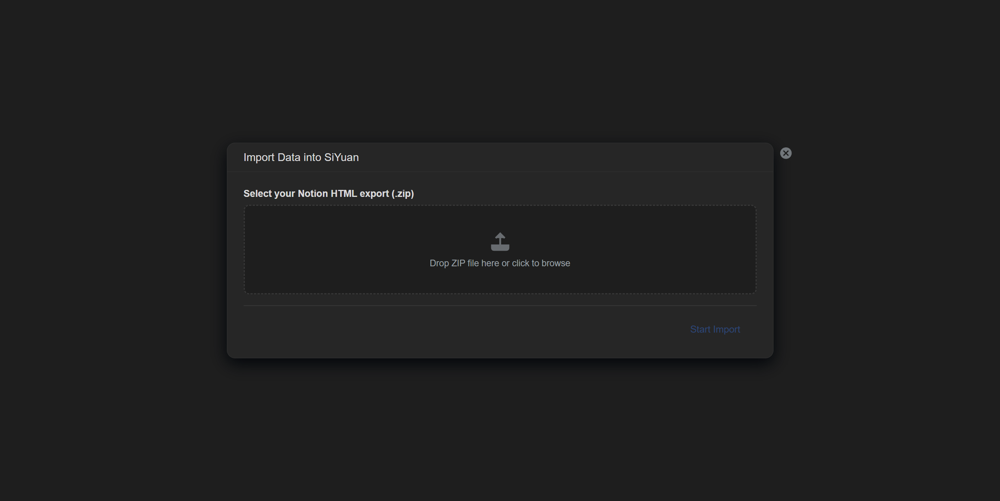

[](https://github.com/FEUAZUR/notion-importer/releases)
[](LICENSE)
[](https://b3log.org/siyuan)
[](https://github.com/FEUAZUR/notion-importer/releases)

# Notion Importer for SiYuan

A SiYuan plugin that imports Notion HTML exports into SiYuan with deterministic hierarchy reconstruction, stable database import, and preserved styles/media.

## Features

- Import Notion HTML ZIP exports into SiYuan
- Full database support with all column types:
  - Title, Text, Number, Date, Select, Multi-Select, Status
  - Checkbox, URL, Email, Phone, File/Asset
  - Created Time, Last Edited Time
  - Relations (imported as text)
- Media import: images, videos, audio files, PDFs, and all attachments
- Cover/banner images preserved as SiYuan document banners
- Page icons (emoji and custom images) preserved
- Document hierarchy faithfully recreated
- Standalone images and embedded media correctly positioned
- Real-time progress with phase indicator, live logs, and error tracking

## Screenshots

### Import dialog



## Usage

### 1. Export from Notion

1. In Notion, go to **Settings & Members** > **Settings**
2. Scroll down to **Export all workspace content**
3. Choose **HTML** as the export format
4. Click **Export** and save the ZIP file

### 2. Import into SiYuan

1. Open SiYuan and click the **Import** button in the top toolbar
2. Drop your Notion ZIP file into the drop zone (or click to browse)
3. Click **Start Import** and watch the progress in real-time
4. Review the summary when complete

## Supported Notion Elements

| Element                      | Support                                 |
| ---------------------------- | --------------------------------------- |
| Pages & subpages             | Full hierarchy preserved                |
| Databases (tables)           | Full with all column types              |
| Images (inline & standalone) | Imported as SiYuan assets               |
| Videos                       | Imported with player controls           |
| Audio                        | Imported with player controls           |
| File attachments             | Imported as SiYuan assets               |
| Cover/banner images          | Set as SiYuan document banner           |
| Page icons                   | Set as SiYuan document icon             |
| Callouts                     | Converted to blockquotes                |
| Code blocks                  | Preserved with language                 |
| Math equations               | Preserved (KaTeX)                       |
| Toggle headings              | Converted to headings                   |
| Checkboxes / To-do lists     | Preserved                               |
| Bookmarks / Embeds           | Converted to blockquotes                |
| Internal links               | Converted to SiYuan bidirectional links |

## Build

```bash
npm install
npm test
npm run build
```

The built plugin will be in the `dist/` directory and packaged as `package.zip`.

## Architecture

- `export-parser`: ZIP walk, `index.html` manifest parsing, registry building
- `notion-normalizer`: canonical write plan for SiYuan
- `siyuan-writer`: notebook/doc/asset/database writes and post-processing

## Development

```bash
npm run dev
```

This starts Vite in watch mode, outputting to the `dev/` directory with live reload.

## Contributing

Contributions are welcome! Feel free to open issues or submit pull requests.

## License

MIT
